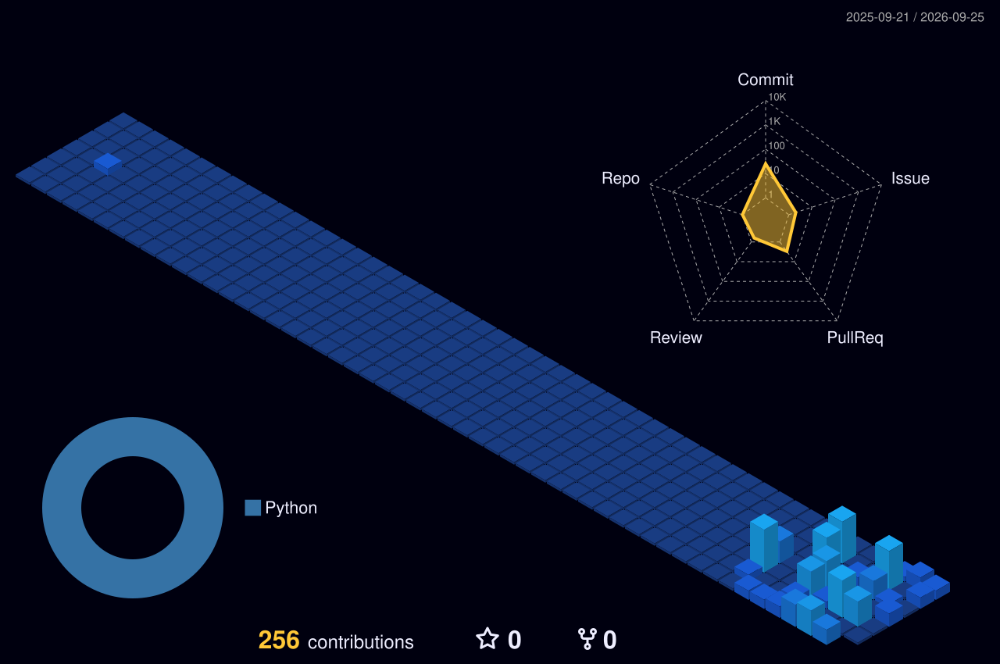

<picture>
  <source media="(prefers-color-scheme: dark)" srcset="https://raw.githubusercontent.com/josias-almeida/josias-almeida/main/dark_mode.svg">
  <source media="(prefers-color-scheme: light)" srcset="https://raw.githubusercontent.com/josias-almeida/josias-almeida/main/light_mode.svg">
  
</picture>

---

# Aerolevantamentos | Aerofotogrametria | Geoprocessamento | Geotecnologias | Drones

 

> *"Concebendo ideias, planejando e construindo plataformas e ferramentas práticas para resolver os desafios do setor de aerolevantamentos e geotecnologias."*

 

---

### 🗺️ Áreas de Domínio & Atuação

- **🚁 Aerolevantamento & Fotogrametria:** Planejamento e execução de voos com drones, geração de ortomosaicos, nuvens de pontos 3D, MDT e MDE.
- **📐 Agrimensura & Topografia:** Levantamentos topográficos, georreferenciamento, cálculos volumétricos e plantas planialtimétricas.
- **🛰️ Geoprocessamento & Sensoriamento Remoto:** Análise de imagens de satélite, índices espectrais (NDVI, NDWI), zoneamento e cartografia temática no QGIS.
- **💻 Desenvolvimento de Plataformas & Automações:** Criação de ferramentas web, scripts de processamento de dados e programas dedicados ao fluxo de trabalho geoespacial.

---

---

### 📊 Atividade & Criação

  

---

  Aerolevantamentos, Agrimensura e Soluções Tecnológicas para o setor Geoespacial.

